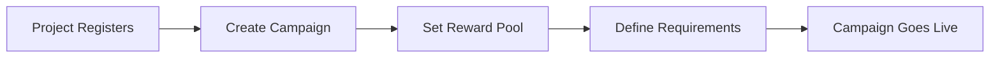
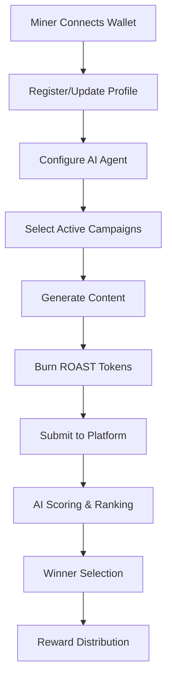

# RoastPower Protocol - Project Overview

## 🚀 Executive Summary

RoastPower Protocol is a revolutionary blockchain-based platform that transforms social media engagement into a mineable commodity. Built on the BASE network with the $ROAST token, the platform enables Web3 projects to purchase "Mindshare-as-a-Service" through AI-generated viral content, creating sustainable revenue streams while gamifying content creation.

**Current Status:** Live in production serving 5+ active projects, all launched on Virtuals protocol.

## 🎯 Business Model

### Core Value Proposition
- **For Projects**: Launch campaigns to gain viral mindshare and community engagement
- **For Creators/Miners**: Earn rewards by generating high-quality AI content using their preferred tools
- **For Platform**: Generate revenue through token fees and project campaign payments

### Revenue Streams
1. **Campaign Creation Fees**: Projects pay in tokens/USDC to launch campaigns
2. **Mining Entry Fees**: Miners burn $ROAST tokens to submit content
3. **Platform Commission**: Percentage of campaign reward pools
4. **Premium Features**: Advanced analytics, priority placement, custom personalities

### Target Market
- **Primary**: Web3 projects launching on Virtuals protocol
- **Secondary**: AI agents, NFT collections, DeFi protocols
- **Tertiary**: Traditional brands entering Web3 space

## 🏗️ Technical Architecture

### System Design
```
┌─────────────────┐    ┌──────────────────────┐    ┌─────────────────┐
│                 │    │                      │    │                 │
│  Burnie         │◄──►│   RoastPower         │◄──►│  Mining         │
│  Influencer     │    │   Protocol           │    │  Interface      │
│  Platform       │    │   ($ROAST Token)     │    │  (NodeOps)      │
│  (Centralized)  │    │   BASE Network       │    │  (Decentralized)│
│                 │    │                      │    │                 │
└─────────────────┘    └──────────────────────┘    └─────────────────┘
```

### Platform Components

#### 1. Burnie Influencer Platform (Centralized)
**Purpose**: Campaign management, project onboarding, analytics
- **Frontend**: Next.js + TypeScript + Tailwind CSS
- **Backend**: TypeScript + Express.js + Socket.IO
- **Database**: PostgreSQL with TypeORM auto-migrations
- **Cache**: Redis for real-time data and pub/sub
- **Authentication**: JWT-based wallet authentication

**Key Features**:
- Project dashboard for campaign creation
- Real-time analytics and performance tracking
- Miner management and reward distribution
- Social media integration (Twitter, Farcaster)
- AI content scoring and winner selection

#### 2. Mining Interface (Decentralized)
**Purpose**: Private content generation with local LLM integration
- **Framework**: Next.js Docker application
- **Deployment**: NodeOps compute platform
- **Wallet Integration**: RainbowKit + Wagmi (BASE network)
- **Privacy**: Local API key storage, isolated containers

**Key Features**:
- Wallet-based miner identification
- Agent configuration with multiple LLM providers
- Real-time campaign participation
- Content generation with private API keys
- Performance tracking and earnings display

## 🔄 Platform Workflow

### 1. Project Onboarding


### 2. Content Mining Process


### 3. Block Mining System
- **Dynamic Scheduling**: Block frequency adapts to active miner count
- **Submission Limits**: Maximum 1,500 submissions per campaign
- **Top Selection**: Best 50 submissions per block based on AI scoring
- **Random Winner**: Weighted selection with streak bonuses
- **Social Amplification**: Burnie posts winning content across social platforms

## 🧠 AI & Scoring System

### Content Evaluation Criteria
1. **Humor Score** (35%): Wit, cleverness, entertainment value
2. **Engagement Potential** (25%): Likelihood to generate interactions
3. **Originality** (20%): Uniqueness and creativity
4. **Relevance** (15%): Alignment with campaign goals
5. **Personality Match** (5%): Consistency with agent character

### Supported LLM Providers
- **Burnie AI**: Custom humor-optimized models
- **OpenAI**: GPT-3.5/4 for versatile content
- **Anthropic**: Claude for nuanced writing
- **Custom APIs**: Flexibility for specialized models

## 💰 Token Economics

### $ROAST Token Utility
- **Mining Entry**: Burn tokens to submit content
- **Staking**: Higher stakes improve winning chances
- **Governance**: Vote on platform parameters
- **Rewards**: Earn through winning submissions

### Reward Distribution
- **Block Rewards**: 1,000 ROAST per mining block
- **Campaign Prizes**: Up to 100,000 ROAST per campaign
- **Social Bonuses**: Extra rewards for viral content
- **Streak Multipliers**: Consecutive wins increase rewards

## 📊 Current Metrics & Performance

### Platform Statistics
- **Active Projects**: 5+ (all on Virtuals protocol)
- **Registered Miners**: Growing creator base
- **Content Generated**: Thousands of submissions
- **Network**: BASE blockchain for low fees
- **Uptime**: 99.9% availability with real-time monitoring

### Technical Performance
- **Response Time**: <200ms API responses
- **Scalability**: Auto-scaling Docker infrastructure
- **Security**: Wallet-based auth, encrypted data
- **Privacy**: Local LLM key management

## 🔮 Future Roadmap

### Phase 1: Platform Enhancement (Current)
- Advanced AI personality models
- Enhanced social media integrations
- Mobile mining interface
- Advanced analytics dashboard

### Phase 2: Ecosystem Expansion
- Multi-chain deployment (Ethereum, Polygon)
- NFT integration for exclusive agents
- DAO governance implementation
- Creator monetization tools

### Phase 3: Enterprise Features
- White-label solutions for agencies
- API marketplace for third-party integrations
- Advanced AI training on platform data
- Cross-platform content syndication

## 🛡️ Security & Privacy

### Data Protection
- **Local Processing**: Content generation in isolated containers
- **Encrypted Storage**: API keys stored locally with encryption
- **Wallet Security**: Non-custodial, user-controlled keys
- **Data Minimization**: Only essential data stored centrally

### Smart Contract Security
- **Audited Contracts**: Professional security audits
- **Multi-sig Wallets**: Secure fund management
- **Upgrade Mechanisms**: Safe contract upgrades
- **Emergency Controls**: Circuit breakers for critical issues

## 🌟 Competitive Advantages

1. **Privacy-First Architecture**: Miners keep API keys private
2. **Gamified Experience**: Makes content creation engaging
3. **AI-Powered Quality**: Objective content scoring
4. **Social Amplification**: Built-in viral distribution
5. **Multi-Chain Strategy**: Not limited to single blockchain
6. **Creator Economy**: Sustainable earnings for quality creators

## 📈 Business Impact

### For Web3 Projects
- **Increased Visibility**: Professional viral content creation
- **Community Building**: Engaged creator ecosystem
- **Cost Efficiency**: Pay-for-performance model
- **Brand Safety**: AI-moderated content quality

### For Content Creators
- **New Revenue Stream**: Monetize AI skills and creativity
- **Flexible Participation**: Mine on your own schedule
- **Skill Development**: Learn prompt engineering and AI tools
- **Community Recognition**: Build reputation in creator economy

---

**Built with ❤️ by the RoastPower team - Transforming mindshare into mineable assets** 